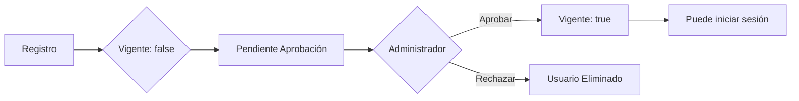

# Sistema de Autenticación y Registro - SIREC_V3

## 📋 Flujo de Registro de Alumnos

### 1. **Registro de Nuevo Alumno**

#### Frontend (`/register`)
El alumno completa el formulario de registro con:
- ✅ **Nombre Completo** (15-50 caracteres, solo letras y espacios)
- ✅ **Correo Electrónico** (@gmail.cl, 15-35 caracteres)
- ✅ **RUT** (formato xx.xxx.xxx-x o xxxxxxxx-x)
- ✅ **Carrera** (selector desplegable con carreras disponibles)
- ✅ **Contraseña** (8-26 caracteres, letras y números)

#### Backend (`POST /api/auth/register`)
1. **Validación de datos** con Joi
2. **Verificación de duplicados**:
   - Email no registrado
   - RUT no registrado
3. **Asignación automática**:
   - Rol: "Alumno"
   - Vigente: `false` (inactivo hasta aprobación)
4. **Creación del usuario**:
   - Contraseña encriptada con bcrypt
   - Usuario guardado en base de datos

#### Resultado
- ✅ Usuario creado exitosamente
- ⏳ **Estado**: Pendiente de aprobación
- 📧 Mensaje: "Tu cuenta está pendiente de aprobación por el administrador"

---

## 🔐 Flujo de Login

### 1. **Intento de Inicio de Sesión**

#### Frontend (`/auth`)
El usuario ingresa:
- ✅ Correo electrónico
- ✅ Contraseña

#### Backend (`POST /api/auth/login`)
1. **Buscar usuario** por correo electrónico
2. **Verificar estado vigente**:
   - Si `Vigente = false` → Error: "Tu cuenta está pendiente de aprobación"
   - Si `Vigente = true` → Continuar
3. **Verificar contraseña** con bcrypt
4. **Generar token JWT** con payload:
   ```json
   {
     "id": 1,
     "nombreCompleto": "Juan Pérez",
     "email": "alumno1.2024@gmail.cl",
     "rut": "21.151.897-9",
     "rol": "Alumno",
     "carrera": "Ingeniería Civil en Informática",
     "vigente": true
   }
   ```
5. **Retornar token** al frontend

#### Frontend (Guardar sesión)
- Token almacenado en cookie: `jwt-auth`
- Datos del usuario en `sessionStorage`:
  ```json
  {
    "id": 1,
    "nombreCompleto": "Juan Pérez",
    "email": "alumno1.2024@gmail.cl",
    "rut": "21.151.897-9",
    "rol": "alumno",
    "carrera": "Ingeniería Civil en Informática",
    "vigente": true
  }
  ```

### 2. **Redirección según Rol**

#### Roles y sus vistas:
| Rol | Vista Inicial | Permisos |
|-----|---------------|----------|
| **Administrador** | `/home` | Acceso total, gestión de usuarios |
| **Director de Escuela** | `/home` | Reportes, gestión de préstamos |
| **Alumno** | `/home` | Mis préstamos, solicitar préstamos |
| **Profesor** | `/home` | Mis préstamos, solicitar préstamos |

---

## 👨‍💼 Aprobación de Alumnos (Administrador)

### Proceso de Aprobación

#### 1. **Vista de Usuarios Pendientes**
El administrador accede a `/users` y ve:
- Lista de usuarios con `Vigente = false`
- Información del alumno:
  - Nombre completo
  - RUT
  - Email
  - Carrera
  - Fecha de registro

#### 2. **Aprobar Usuario**
```javascript
PUT /api/users/:id
{
  "Vigente": true
}
```

#### 3. **Rechazar Usuario**
```javascript
DELETE /api/users/:id
```

### Estados del Usuario



---

## 🔒 Protección de Rutas

### Frontend - ProtectedRoute Component
```jsx
<ProtectedRoute allowedRoles={['administrador']}>
  <Users />
</ProtectedRoute>
```

### Roles disponibles:
- `'administrador'` - Acceso total
- `'director de escuela'` - Gestión de préstamos y reportes
- `'alumno'` - Vista limitada
- `'profesor'` - Vista limitada (igual que alumno)

---

## 📝 Validaciones Implementadas

### Frontend (React Hook Form)
- ✅ Validación en tiempo real
- ✅ Mensajes de error personalizados
- ✅ Validación de formato de correo (@gmail.cl)
- ✅ Validación de formato de RUT
- ✅ Longitud de campos

### Backend (Joi)
- ✅ Validación de tipos de datos
- ✅ Validación de formatos (email, RUT, contraseña)
- ✅ Validación de longitud de campos
- ✅ Prevención de propiedades adicionales
- ✅ Mensajes de error en español

---

## 🔄 Flujos de Error

### Error: Email Duplicado
```
❌ Error: "Correo electrónico en uso"
📍 Campo afectado: email
```

### Error: RUT Duplicado
```
❌ Error: "Rut ya asociado a una cuenta"
📍 Campo afectado: rut
```

### Error: Usuario No Vigente
```
❌ Error: "Tu cuenta está pendiente de aprobación por el administrador"
📍 Acción: Esperar aprobación del administrador
```

### Error: Credenciales Incorrectas
```
❌ Email incorrecto: "El correo electrónico es incorrecto"
❌ Contraseña incorrecta: "La contraseña es incorrecta"
```

---

## 🛠️ Archivos Modificados

### Backend
1. ✅ **`services/auth.service.js`**
   - Función `registerService`: Asigna rol "Alumno" y `Vigente: false`
   - Función `loginService`: Verifica estado vigente antes de login

2. ✅ **`validations/auth.validation.js`**
   - Agregado campo `carreraId` (requerido, número positivo)

3. ✅ **`routes/carrera.routes.js`**
   - Ruta `GET /carrera` ahora es pública (sin autenticación)

4. ✅ **`config/initialSetup.js`**
   - Roles actualizados: Administrador, Alumno, Profesor, Director de Escuela
   - Usuarios de prueba creados para cada rol

### Frontend
1. ✅ **`pages/Register.jsx`**
   - Agregado campo de selección de carrera
   - Mensaje de éxito actualizado con información de aprobación

2. ✅ **`hooks/auth/useRegister.jsx`**
   - Agregado estado para carreras
   - Función `fetchCarreras` para obtener lista de carreras
   - Manejo de error de carrera

3. ✅ **`services/auth.service.js`**
   - Función `login`: Decodifica y almacena información completa del usuario
   - Función `register`: Envía `carreraId` en el registro

4. ✅ **`services/carrera.service.js`** (nuevo)
   - Función `getCarreras`: Obtiene lista de carreras disponibles

---

## 🧪 Pruebas

### Registro de Alumno
```bash
# Endpoint: POST /api/auth/register
{
  "nombreCompleto": "María José González Pérez",
  "email": "maria.gonzalez@gmail.cl",
  "rut": "22.345.678-9",
  "password": "password123",
  "carreraId": 1
}
```

**Respuesta esperada:**
```json
{
  "status": "Success",
  "message": "Usuario registrado con éxito",
  "data": {
    "ID_Usuario": 11,
    "Nombre_Completo": "María José González Pérez",
    "Correo": "maria.gonzalez@gmail.cl",
    "Rut": "22.345.678-9",
    "Vigente": false
  }
}
```

### Login con Usuario No Vigente
```bash
# Endpoint: POST /api/auth/login
{
  "email": "maria.gonzalez@gmail.cl",
  "password": "password123"
}
```

**Respuesta esperada:**
```json
{
  "status": "Client error",
  "details": {
    "dataInfo": "email",
    "message": "Tu cuenta está pendiente de aprobación por el administrador"
  }
}
```

### Login Exitoso
```bash
# Endpoint: POST /api/auth/login
{
  "email": "alumno1.2024@gmail.cl",
  "password": "alumno1234"
}
```

**Respuesta esperada:**
```json
{
  "status": "Success",
  "message": "Inicio de sesión exitoso",
  "data": {
    "token": "eyJhbGciOiJIUzI1NiIsInR5cCI6IkpXVCJ9..."
  }
}
```

---

## 📊 Estados de Usuarios

| Estado | Vigente | Puede Login | Descripción |
|--------|---------|-------------|-------------|
| **Pendiente** | `false` | ❌ | Esperando aprobación del admin |
| **Aprobado** | `true` | ✅ | Usuario activo en el sistema |
| **En Lista Negra** | `false` | ❌ | Usuario sancionado temporalmente |

---

## ✨ Características Implementadas

### ✅ Registro de Alumnos
- Formulario completo con validaciones
- Selección de carrera desde base de datos
- Estado inicial inactivo (Vigente: false)
- Mensajes informativos sobre aprobación

### ✅ Sistema de Login
- Validación de credenciales
- Verificación de estado vigente
- Token JWT con información completa
- Redirección según rol

### ✅ Seguridad
- Contraseñas encriptadas con bcrypt
- Tokens JWT con expiración (24 horas)
- Validación de duplicados (email y RUT)
- Protección de rutas en frontend y backend

### ✅ Experiencia de Usuario
- Mensajes de error claros y específicos
- Validación en tiempo real
- Feedback visual de errores
- Indicadores de estado (pendiente, aprobado)

---

## 🚀 Próximos Pasos

1. **Notificaciones**
   - ✉️ Email de bienvenida al registrarse
   - ✉️ Email de aprobación de cuenta
   - ✉️ Email de rechazo de cuenta

2. **Dashboard de Administrador**
   - 📊 Lista de usuarios pendientes de aprobación
   - 📊 Botones de aprobar/rechazar
   - 📊 Historial de aprobaciones

3. **Recuperación de Contraseña**
   - 🔑 Solicitud de reset via email
   - 🔑 Token temporal de recuperación
   - 🔑 Cambio de contraseña seguro

4. **Auditoría**
   - 📝 Log de intentos de login
   - 📝 Log de cambios de estado de usuarios
   - 📝 Registro de actividades administrativas
